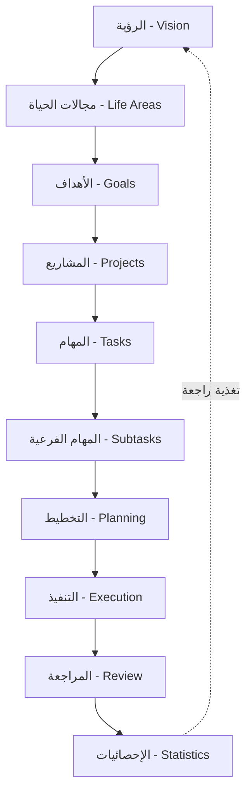
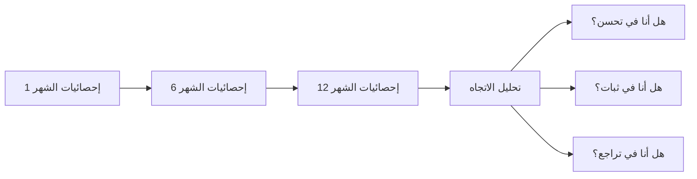
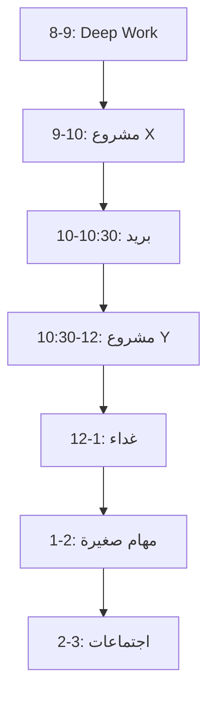

# دليل تشغيل Life OS — النظام المتكامل لإدارة الحياة

> **الإصدار 2.0 — الدليل الرسمي**

---

## جدول المحتويات

1. [فلسفة Life OS](#1-فلسفة-life-os)
2. [سير العمل الأساسي](#2-سير-العمل-الأساسي)
3. [اليوم الأول — الإعداد](#3-اليوم-الأول--الإعداد)
4. [سير العمل اليومي](#4-سير-العمل-اليومي)
5. [سير العمل الأسبوعي](#5-سير-العمل-الأسبوعي)
6. [سير العمل الشهري](#6-سير-العمل-الشهري)
7. [سير العمل السنوي](#7-سير-العمل-السنوي)
8. [مبادئ الإنتاجية](#8-مبادئ-الإنتاجية)
9. [تنظيم مختلف مجالات الحياة](#9-تنظيم-مختلف-مجالات-الحياة)
10. [مثال واقعي — شهر كامل](#10-مثال-واقعي--شهر-كامل)
11. [أفضل الممارسات](#11-أفضل-الممارسات)
12. [الأخطاء الشائعة](#12-الأخطاء-الشائعة)
13. [المساعد الذكي — AI Assistant](#13-المساعد-الذكي--ai-assistant)
14. [اختصارات لوحة المفاتيح](#14-اختصارات-لوحة-المفاتيح)
15. [الأسئلة الشائعة FAQ](#15-الأسئلة-الشائعة-faq)
16. [استكشاف الأخطاء وإصلاحها](#16-استكشاف-الأخطاء-وإصلاحها)
17. [بيان Life OS](#17-بيان-life-os)

---

## 1. فلسفة Life OS

### لماذا يوجد Life OS؟

> *"العقل مكان رائع للتجربة، لكنه مكان سيء للتخزين."* — David Allen

أنظمة إدارة المهام العادية تفشل لأنها تتعامل مع الحياة كقائمة مهام لا نهائية. Life OS مختلف. إنه **نظام تشغيل شخصي** يحول فوضى الحياة اليومية إلى سير عمل منظم وواضح.

الحياة ليست مجرد مهام. الحياة هي:
- **رؤية** تبنيها
- **مجالات** تعيشها
- **أهداف** تحققها
- **مشاريع** تنفذها
- **مهام** تنجزها
- **عادات** تبنيها
- **مراجعات** تحسنها
- **إحصائيات** تقيسها

### العقلية الصحيحة

| العقلية الخطأ | العقلية الصحيحة |
|---|---|
| "سأتذكر كل شيء" | "أوثق كل شيء خارج عقلي" |
| "يجب أن أعمل أكثر" | "يجب أن أعمل على ما يهم" |
| "غداً سأبدأ" | "سأبدأ الآن بخطوة صغيرة" |
| "هذا المشروع ضخم" | "هذا المشروع = خطوات صغيرة" |
| "ليس لدي وقت" | "أنا أختار أين أذهب بوقتي" |

### لماذا مجرد جمع المهام لا يكفي؟

تطبيقات المهام تجعلك مشغولاً، لكنها لا تجعلك منتجاً. الفرق بين **المشغولية** و **الإنتاجية**:

```
المشغولية:        تفعل أشياء كثيرة ← تشعر بالتعب ← لا تتقدم
الإنتاجية:        تفعل الأشياء الصحيحة ← تشعر بالإنجاز ← تتقدم
```

Life OS يضمن أن كل مهمة تؤديها مرتبطة بهدف، وكل هدف مرتبط بمجال حياة، وكل مجال حياة مرتبط برؤيتك الكبرى.

### كيف ينظم الناجحون حياتهم؟

الناجحون لا يمتلكون ذاكرة أفضل. يمتلكون **أنظمة أفضل**:

1. **Elon Musk**: يفكر على مستوى الأهداف الجذرية (First Principles)
2. **Warren Buffett**: قاعدة "الأشياء القليلة المهمة" — 5 أشياء فقط سنوياً
3. **Tim Ferriss**: تطبيق قاعدة 80/20 في كل شيء
4. **David Allen**: GTD — العقل الصافي هو الأساس
5. **Tiago Forte**: PARA — تنظيم المعرفة حسب قابليتها للتنفيذ

Life OS يجمع أفضل ما في هذه الفلسفات في نظام واحد متكامل.

### هرم Life OS



كل مستوى يغذي الذي يليه، والمراجعة تغذي الرؤية من جديد.

---

## 2. سير العمل الأساسي

### 1. مجالات الحياة — Life Areas

**التعريف**: المجالات الكبرى التي تتكون منها حياتك. ليست أهدافاً، بل فئات وجودية.

**أمثلة واقعية**:

| المجال | ماذا يشمل |
|---|---|
| الصحة واللياقة | التمرين، الطعام، النوم، الفحوصات الطبية |
| العائلة والعلاقات | الزوج/الزوجة، الأبناء، الوالدين، الأصدقاء |
| المهنة والعمل | المشاريع المهنية، التطوير الوظيفي، التواصل |
| المال والاستثمار | الدخل، المصروفات، الادخار، الاستثمار |
| العلم والتعلم | الدورات، الكتب، المهارات الجديدة |
| الإيمان والروحانيات | العبادات، القرآن، الذكر، التطوع |
| التطوير الذاتي | العادات، القراءة، المهارات الشخصية |

**قاعدة ذهبية**: لا تجعل مجالات حياتك أكثر من 8 مجالات. 5-7 هو الرقم المثالي.

### 2. الأهداف — Goals

**التعريف**: نتائج محددة وقابلة للقياس تريد تحقيقها في مجال معين خلال إطار زمني.

**SMART Goals في Life OS**:

| الحرف | المعنى | مثال |
|---|---|---|
| S | Specific — محدد | "خسارة 10 كجم" وليس "إنقاص وزني" |
| M | Measurable — قابل للقياس | "قراءة 12 كتاباً" وليس "قراءة المزيد" |
| A | Achievable — قابل للتحقيق | "توفير 20,000 ريال" وليس "مليون ريال في شهر" |
| R | Relevant — مرتبط بالمجال | هدف في مجال الصحة وليس هدفاً عشوائياً |
| T | Time-bound — محدد بزمن | "بنهاية ديسمبر 2026" |

### 3. المشاريع — Projects

**التعريف**: مجموعة من المهام المترابطة التي تحقق هدفاً محدداً.

**الفرق بين المشروع والمهمة**:

| المشروع | المهمة |
|---|---|
| له بداية ونهاية | يمكن إنجازها في جلسة واحدة |
| يتكون من 5-20 مهمة | عادة 15-60 دقيقة |
| مثال: "تجهيز موقع شخصي" | مثال: "كتابة الصفحة الرئيسية" |

### 4. المهام — Tasks

**التعريف**: أصغر وحدة عمل قابلة للتنفيذ.

**قواعد كتابة المهام**:

1. تبدأ بفعل: "اتصل بـ..."، "اكتب..."، "أرسل..."
2. محددة زمنياً: "30 دقيقة" وليس "سأعمل عليها"
3. قابلة للتنفيذ فوراً: "شراء البقالة" وليس "تنظيم المطبخ"

### 5. المهام الفرعية — Subtasks

**التعريف**: خطوات داخل مهمة واحدة.

**متى تستخدم؟**:
- عندما تحتاج المهمة إلى 2-4 خطوات
- عندما تريد تتبع التقدم داخل مهمة
- عندما تتعاون مع آخرين على مهمة

### 6. التخطيط — Planning

**ثلاث طرق للتخطيط**:

```
يومي:     جدولة مهام اليوم في فترات زمنية
أسبوعي:   توزيع المهام على أيام الأسبوع
شهري:     نظرة عامة على المشاريع والأهداف
```

### 7. التنفيذ — Execution

**صفحة /today** هي قلب التنفيذ. كل صباح تفتحها وتجد:
- مهام اليوم المخطط لها
- المهام المتأخرة
- العادات اليومية
- صندوق الوارد (Inbox)

### 8. المراجعة — Review

> *"بدون مراجعة، أنت تقود سيارة بعيون مغلقة."*

المراجعة هي نقطة التحول. فيها تنظر إلى:
- ما أنجزته
- ما لم تنجزه
- لماذا؟
- ماذا ستفعل غداً/الأسبوع القادم؟

### 9. الإحصائيات — Statistics

الإحصائيات هي مرآة أدائك. فيها ترى:
- نسبة إنجاز المهام (الأسبوعية/الشهرية)
- توزيع المهام حسب الأولوية
- أداء العادات
- توزيع الوقت على مجالات الحياة
- خط الاتجاه — هل أنت في تحسن أم تراجع؟

---

## 3. اليوم الأول — الإعداد

### خطوة 1: إنشاء مجالات الحياة

**المطلوب**: 5-7 مجالات تغطي كل جوانب حياتك.

**مثال — أحمد، 28 سنة، مهندس برمجيات**:

```
1. الصحة واللياقة
2. العائلة والعلاقات
3. المهنة — تطوير البرمجيات
4. المال والاستثمار
5. العلم والتعلم المستمر
6. الإيمان والروحانيات
7. التطوير الذاتي
```

> **💡 نصيحة**: انظر إلى حياتك اليوم. في أي مجالات تقضي وقتك؟ تلك هي مجالاتك.

**تمرين اليوم الأول**:
- [ ] افتح صفحة Life Areas
- [ ] أضف 5-7 مجالات
- [ ] لكل مجال، اكتب وصفاً من سطر واحد
- [ ] رتبها حسب الأولوية في حياتك الآن

### خطوة 2: إنشاء الأهداف

لكل مجال، اختر 1-3 أهداف للربع الحالي (3 أشهر).

**مثال — مجال الصحة**:

| الهدف | المدة | القياس |
|---|---|---|
| خسارة 8 كجم | 3 أشهر | وزن أسبوعي |
| المشي 10,000 خطوة يومياً | مستمر | عداد الخطوات |
| نوم 7 ساعات يومياً | مستمر | ساعات النوم |

**تمرين اليوم الأول**:
- [ ] لكل مجال، اكتب هدفاً واحداً على الأقل
- [ ] تأكد من أن الهدف SMART
- [ ] حدد تاريخ نهاية لكل هدف

### خطوة 3: إنشاء المشاريع

قسّم كل هدف إلى مشاريع.

**مثال — هدف "خسارة 8 كجم":**

```
المشروع 1: وضع خطة غذائية
  └── المهام: استشارة أخصائي تغذية ← وضع meal plan ← تجهيز المطبخ
المشروع 2: تجهيز روتين رياضي
  └── المهام: الاشتراك في نادي ← جدول تمارين ← شراء مستلزمات
```

**تمرين اليوم الأول**:
- [ ] اختر هدفاً واحداً
- [ ] قسّمه إلى 2-3 مشاريع
- [ ] لكل مشروع، اكتب 3-5 مهام أولية

### خطوة 4: إضافة المهام إلى Inbox

كل ما يدور في رأسك الآن — أفرغه في Inbox.

> **🔥 قاعدة الـ 2 دقيقة**: أي مهمة تستغرق أقل من دقيقتين، افعلها الآن. الباقي ادخلها في Inbox.

**تمرين اليوم الأول**:
- [ ] افتح صفحة Inbox
- [ ] أضف كل ما تفكر به (20-30 مهمة على الأقل)
- [ ] لا تقلق بشأن التنظيم الآن — فقط أفرغ عقلك

### خطوة 5: إنشاء العادات

اختر 3 عادات تريد بناءها.

**قاعدة العادات الجديدة**:
- ابدأ بعادة واحدة فقط للأسبوع الأول
- اجعلها صغيرة جداً: "قراءة صفحة واحدة يومياً"
- اربطها بعادة موجودة: "بعد فنجان القهوة، سأقرأ صفحة"

**تمرين اليوم الأول**:
- [ ] اختر 3 عادات
- [ ] اجعل كل عادة صغيرة جداً (تستغرق < 5 دقائق)
- [ ] حدد وقتاً ثابتاً لكل عادة
- [ ] اربطها بمجال الحياة المناسب

### خطوة 6: التخطيط للأسبوع الأول

لا تخطط كثيراً. الأسبوع الأول هو أسبوع التعود على النظام.

**خطة الأسبوع الأول**:

```
اليوم 1-2:     إنشاء المجالات والأهداف
اليوم 3-4:     إنشاء المشاريع الأولى
اليوم 5-6:     تنظيم Inbox
اليوم 7:       المراجعة الأولى
```

---

## 4. سير العمل اليومي

### الصباح — مراجعة الصباح (10 دقائق)

> *"كيف تكسب أول 10 دقائق من يومك يحدد كيف تكسب باقيه."*

**قائمة الصباح**:

1. **افتح /today** (دقيقة)
   - [ ] راجع مهام اليوم
   - [ ] راجع المهام المتأخرة

2. **اختر Big 3** (دقيقتان)
   - اختر 3 مهام كبرى لهذا اليوم
   - الأولى هي "الضفدعة" — أصعب وأهم مهمة

3. **راجع العادات** (دقيقة)
   - [ ] ما هي عادة اليوم؟
   - [ ] متى ستؤديها؟

4. **جدول زمني** (5 دقائق)
   ```
   ٨-١٠ ص:    الضفدعة — المهمة الأكبر
   ١٠-١٢ م:   مهام متوسطة
   ١٢-١ م:    استراحة
   ١-٣ م:     مهام صغيرة وبريد
   ٣-٥ م:     مشاريع إبداعية
   ٥-٦ م:     إنهاء المهام العالقة
   ```

5. **نية اليوم** (دقيقة)
   - اكتب جملة واحدة: "اليوم سأنجز ____ وأشعر بـ ____"

### منتصف اليوم — التنفيذ

**قواعد التنفيذ**:

- **Deep Work**: أول ساعتين من اليوم — لا هاتف، لا بريد، لا اجتماعات
- **Batch Processing**: تعامل مع البريد والرسائل دفعة واحدة في وقت محدد
- **Pomodoro**: 25 دقيقة عمل + 5 دقائق راحة
- **لا تعدد مهام**: مهمة واحدة حتى تنتهي أو تصل لنقطة توقف

**عند المقاطعة**:
```
هل هي عاجلة ومهمة؟  → تعامل معها فوراً
عاجلة لكن غير مهمة؟ ← فوضها أو حدد موعداً
مهمة لكن غير عاجلة؟ ← أضفها إلى Inbox
لا عاجلة ولا مهمة؟  ← احذفها
```

### المساء — مراجعة المساء (5 دقائق)

> *"اليوم الذي لا تراجعه هو يوم ضائع."*

**قائمة المساء**:

1. [ ] **أكملت Big 3؟** — إذا لا، لماذا؟
2. [ ] **سجل العادات** — هل أديت عاداتك اليوم؟
3. [ ] **أنظف Inbox** — أضف أي شيء جديد
4. [ ] **خطط للغد** — اختر 3 مهام للغد
5. [ ] **اكتب الإنجاز** — جملة واحدة عن أفضل ما فعلته اليوم

### نموذج اليوم المثالي

```
٥:٣٠ ص    — الاستيقاظ
٥:٤٥ ص    — صلاة الفجر + ورد يومي
٦:١٥ ص    — تمرين خفيف
٦:٤٥ ص    — مراجعة Life OS /today
٧:٠٠ ص    — إفطار
٧:٣٠ ص    — Deep Work (الضفدعة)
٩:٣٠ ص    — استراحة 10 دقائق
٩:٤٠ ص    — المهمة الكبيرة الثانية
١١:٣٠ ص   — مهام متوسطة
١٢:٣٠ م   — غداء + راحة
١:٣٠ م    — مهام صغيرة + بريد
٣:٠٠ م    — مشاريع / تعلم
٤:٣٠ م    — عصر + استراحة
٥:٠٠ م    — إنجاز المهام العالقة
٦:٠٠ م    — وقت عائلي
٨:٠٠ م    — عشاء
٩:٠٠ م    — مراجعة Life OS المسائية
٩:١٥ م    — وقت شخصي / قراءة
١٠:٠٠ م   — نوم
```

> **⚠️ تحذير**: هذا نموذج مثالي. حياتك مختلفة. عدّله ليناسبك. المهم هو المبادئ وليس النسخ الحرفي.

---

## 5. سير العمل الأسبوعي

### المراجعة الأسبوعية — Weekly Review (30-60 دقيقة)

> *"المراجعة الأسبوعية هي المفتاح الذي يفتح كل شيء في GTD."* — David Allen

**الموعد المثالي**: الجمعة مساءً أو السبت صباحاً

### القائمة الكاملة للمراجعة الأسبوعية

#### المرحلة 1: التنظيف (10 دقائق)

1. **Inbox** — صفّر Inbox بالكامل
   - [ ] كل بريد إلكتروني → مهمة أو مشروع أو حذف
   - [ ] كل رسالة واتساب → مهمة أو حذف
   - [ ] كل فكرة → أضفها كمهمة أو مشروع
   - [ ] الصفر Inbox يجب أن يكون هدفك كل أسبوع

2. **المهام المكتملة** — راجعها
   - [ ] احتفل بما أنجزته
   - [ ] هل هناك مهام تكررت؟ فكر في أتمتتها

#### المرحلة 2: التحديث (15 دقيقة)

3. **المشاريع** — راجع كل مشروع
   - [ ] هل كل مشروع له خطوة تالية واضحة؟
   - [ ] هل هناك مشاريع عالقة؟ حدد السبب
   - [ ] هل هناك مشاريع جديدة يجب إضافتها؟

4. **الأهداف** — راجع التقدم
   - [ ] هل أنت على المسار الصحيح لتحقيق أهداف الربع؟
   - [ ] إذا لا، ماذا ستفعل مختلفاً؟

5. **العادات** — راجع الأسبوع
   - [ ] كم يوماً التزمت بكل عادة؟
   - [ ] هل هناك عادة تحتاج تعديلاً؟

#### المرحلة 3: التخطيط (15 دقيقة)

6. **المهام المتأخرة** — راجعها
   - [ ] هل المهمة لا تزال ضرورية؟ → احذفها
   - [ ] هل هي ضرورية لكن غير عاجلة؟ ← أعد جدولتها
   - [ ] هل هي ضرورية وعاجلة؟ ← اجعلها أولوية الأسبوع

7. **المهام القادمة** — خطط للأسبوع
   - [ ] اختر Big 3 للأسبوع
   - [ ] وزع المهام على أيام الأسبوع
   - [ ] حدد مواعيد Deep Work

#### المرحلة 4: المراجعة (10 دقائق)

8. **الإحصائيات الأسبوعية**
   - [ ] كم مهمة أنجزت؟ هل هو أعلى/أقل من المتوسط؟
   - [ ] ما هي أنسب أوقاتك للإنجاز؟
   - [ ] ما هي أكبر مشتتاتك هذا الأسبوع؟

9. **التعلم**
   - [ ] ما الدرس الذي تعلمته هذا الأسبوع؟
   - [ ] ما الذي سأفعله بشكل مختلف الأسبوع القادم؟

### نموذج المراجعة الأسبوعية

```
الأسبوع: ____     التاريخ: ____

الإنجازات:
1. ____
2. ____
3. ____

ما لم ينجز:
1. ____  السبب: ____
2. ____  السبب: ____

العادات:
  العادة    |  س  ح  ن  أ  ر  خ  ج  | النسبة
  _________ | _  _  _  _  _  _  _  | __%
  _________ | _  _  _  _  _  _  _  | __%

Big 3 للأسبوع القادم:
1. ____
2. ____
3. ____

الدرس المستفاد: ____
```

---

## 6. سير العمل الشهري

### المراجعة الشهرية — Monthly Review (1-2 ساعات)

> *"الشهر هو الوحدة المثالية للقياس — طويل بما يكفي لرؤية التقدم، قصير بما يكفي لتصحيح المسار."*

#### القسم 1: مراجعة الأهداف (25 دقيقة)

**لكل هدف**:

| السؤال | الإجابة |
|---|---|
| هل أنت متقدم أم متأخر؟ | نسبة الإنجاز: __% |
| هل الهدف لا يزال مناسباً؟ | نعم / لا — إذا لا، لماذا؟ |
| ما هي العقبة الأكبر؟ | ____ |
| ما هو الإجراء التصحيحي؟ | ____ |

**قاعدة 1-3-5 الشهرية**:
```
هدف كبير:    ____  (إنجاز كبير تريد تحقيقه هذا الشهر)
3 أهداف متوسطة: ____, ____, ____
5 مهام صغيرة: ____, ____, ____, ____, ____
```

#### القسم 2: تحليل العادات (15 دقيقة)

| العادة | الالتزام الشهري | الاتجاه | تعديل؟ |
|---|---|---|---|
| قراءة يومية | 25/30 يوماً | 📈 تحسن | لا |
| تمرين | 18/30 يوماً | 📉 تراجع | نعم — قلل إلى 3 مرات أسبوعياً |

**أسئلة العادات**:
- هل هناك عادة يجب أن أتوقف عنها؟ (مثال: تصفح الهاتف صباحاً)
- هل هناك عادة جديدة يجب أن أبدأها؟ (مثال: كتابة صفحة يومياً)
- ما هي العادة التي أثرت أكثر في إنتاجيتي؟

#### القسم 3: القراءة والكتب (10 دقائق)

- [ ] كم كتاباً قرأت هذا الشهر؟
- [ ] ما هي الأفكار الرئيسية التي أخذتها؟
- [ ] هل هناك كتاب يجب أن أقرأه الشهر القادم؟

#### القسم 4: الإحصائيات (15 دقيقة)

**افتح صفحة Statistics**:

```
المهام المنجزة:   __/__  (نسبة: __%)
الأكثر إنتاجاً:   أيام ____
الأقل إنتاجاً:    أيام ____
أفضل وقت للإنجاز: ____
المجال الأكثر تركيزاً: ____
المجال الأهمل:    ____
```

**الأسئلة التحليلية**:
- هل أنت مشغول أم منتج؟ تقضي وقتك في المهام عالية الأولوية أم low-priority?
- هل تتجنب شيئاً؟ مهمة تأجلت 3 أسابيع متتالية؟
- هل هناك خلل في التوازن؟ مجال يستحوذ على كل وقتك؟

#### القسم 5: خطة الشهر القادم (20 دقيقة)

1. **تعديل الأهداف** — أضف، احذف، عدّل
2. **توزيع المشاريع** — أي مشروع يبدأ هذا الشهر؟
3. **تحديد الأولويات** — Big 3 للشهر
4. **جدولة المراجعات** — متى المراجعة الأسبوعية القادمة؟
5. **تعديل العادات** — استمر، زد، قلّل، أضف، احذف

### نموذج المراجعة الشهرية

```
الشهر: ____     السنة: ____

    الهدف    | نسبة الإنجاز | الحالة | الخطة
  __________ | ____________ | ______ | _____
  __________ | ____________ | ______ | _____

إجمالي المهام المنجزة: ____
متوسط المهام أسبوعياً: ____

أفضل إنجاز هذا الشهر: ____
أسوأ لحظة هذا الشهر: ____

ماذا تعلمت؟ ____

Big 3 للشهر القادم:
1. ____
2. ____
3. ____

العادة الجديدة: ____
العادة التي سأتوقف عنها: ____
```

---

## 7. سير العمل السنوي

### المراجعة السنوية — Annual Review (4-8 ساعات)

> *"فكر في سنة. الآن فكر في 10 سنوات. القرارات التي تتخذها اليوم تشكلهما."*

**الموعد**: آخر أسبوع في ديسمبر أو أول أسبوع في يناير

#### الجزء 1: استعراض العام (ساعة واحدة)

1. **الإنجازات الكبرى** — اكتب 10-20 إنجازاً كبيراً
2. **الدروس المستفادة** — اكتب 5-10 دروس
3. **أفضل لحظات العام** — ذكريات إيجابية
4. **أسوأ لحظات العام** — ماذا تعلمت منها؟

#### الجزء 2: مراجعة الأهداف السنوية (ساعة)

| الهدف السنوي | النتيجة | النسبة | الدرس |
|---|---|---|---|
| ____ | تم/لم يتم | __% | ____ |

#### الجزء 3: مراجعة مجالات الحياة (ساعة)

لكل مجال:

```
المجال: الصحة
ما تحسن؟   ____
ما تراجع؟  ____
الدرجة (1-10): __/10
الهدف للعام القادم: ____
```

#### الجزء 4: تحليل الاتجاه (30 دقيقة)



#### الجزء 5: الرؤية — 5 سنوات (ساعة)

> *"معظم الناس يبالغون في تقدير ما يمكنهم فعله في سنة ويقللون من تقدير ما يمكنهم فعله في 5 سنوات."*

- أين تريد أن تكون بعد 5 سنوات؟
- ماذا سيكون إنجازك الأكبر؟
- من سيكون الشخص الذي أصبحته؟

#### الجزء 6: خطة العام الجديد (ساعة)

1. **مجالات الحياة** — هل تحتاج إضافة/حذف/دمج مجالات؟
2. **أهداف العام** — 3-5 أهداف كبرى
3. **أهداف الربع الأول** — قسّم الأهداف السنوية إلى أرباع
4. **المشاريع الكبرى** — ما هي المشاريع التي ستبدأها؟
5. **العادات** — ما هي العادات التي ستبنيها هذا العام؟

### نموذج الخطة السنوية

```
العام: 2026

الرؤية: ____

مجالات الحياة (7):
1. ____
2. ____
3. ____
4. ____
5. ____
6. ____
7. ____

الأهداف الكبرى (3-5):
1. ____
2. ____
3. ____

Q1 الأهداف: ____
Q2 الأهداف: ____
Q3 الأهداف: ____
Q4 الأهداف: ____

العادات الجديدة:
- Q1: ____
- Q2: ____
- Q3: ____
- Q4: ____

الكلمة التي سترافقني هذا العام: ____
```

---

## 8. مبادئ الإنتاجية

### 1. GTD — Getting Things Done

**المؤسس**: David Allen

**الفكرة الأساسية**: عقلك ليس للتخزين، بل للتفكير. أخرج كل شيء من رأسك.

**التطبيق في Life OS**:

```
GTD Step              | Life OS Feature
______________________|______________________
Capture               | Inbox — اجمع كل شيء
Clarify               | تحويل Inbox إلى مهام
Organize              | المجالات ← الأهداف ← المشاريع ← المهام
Reflect               | المراجعة الأسبوعية
Engage                | /today — صفحة التنفيذ
```

**النصيحة الذهبية**: إذا كان لديك أكثر من 20 عنصراً في Inbox، توقف عن العمل ورتب Inbox أولاً.

### 2. Deep Work

**المؤسس**: Cal Newport

**الفكرة الأساسية**: العمل العميق (بدون تشتيت) هو المهارة الأكثر قيمة في الاقتصاد الحديث.

**التطبيق في Life OS**:

- جدول "Deep Work Blocks" في صفحة التخطيط
- ضع المهام الكبرى في أول اليوم
- استخدم Pomodoro 25/5 أو 50/10
- المهام التي تتطلب Deep Work → أولوية عالية

**قاعدة الـ 4 ساعات**: 4 ساعات من Deep Work يومياً أكثر إنتاجاً من 8 ساعات من العمل المشتت.

### 3. Time Blocking

**المؤسس**: Elon Musk, Cal Newport

**الفكرة الأساسية**: لا تعمل بقائمة مهام، اعمل بجدول زمني. كل فترة زمنية مخصصة لنشاط محدد.

**التطبيق في Life OS**:



**النصيحة**: اترك 20-30% من يومك فارغاً للطوارئ والمهام غير المتوقعة.

### 4. Eat The Frog

**المؤسس**: Brian Tracy

**الفكرة الأساسية**: افعل أصعب مهمة أول شيء في الصباح. بعدها كل شيء أسهل.

**التطبيق في Life OS**:

- في صفحة /today، أول Big 3 يجب أن يكون "الضفدعة"
- لا تفعل أي شيء آخر قبل إنجازها
- جدولها في أول Deep Work Block

### 5. قاعدة الدقيقتين — 2-Minute Rule

**المؤسس**: David Allen

**الفكرة الأساسية**: إذا كانت المهمة تستغرق أقل من دقيقتين، افعلها الآن.

**التطبيق في Life OS**:

- لا تدخل المهام الصغيرة في Inbox
- أنجزها فوراً
- أمثلة: "إرسال بريد قصير"، "إضافة حدث للتقويم"

### 6. قاعدة 80/20 — Pareto Principle

**المؤسس**: Vilfredo Pareto

**الفكرة الأساسية**: 80% من النتائج تأتي من 20% من الجهود.

**التطبيق في Life OS**:

- راجع مهامك الأسبوعية: أي 20% من المهام أنتجت 80% من النتائج؟
- في صفحة Statistics، انظر إلى المهام عالية الأولوية — هل تعطيها الوقت الكافي؟
- كل شهر، اسأل: "ما هو 20% الذي يجب أن أركز عليه؟"

### 7. Second Brain — العقل الثاني

**المؤسس**: Tiago Forte

**الفكرة الأساسية**: نظام خارجي لتخزين وتنظيم ومعالجة المعلومات.

**التطبيق في Life OS**:

- Life OS نفسه هو عقلك الثاني للمهام والمشاريع
- المهام المكتملة → سجل الإنجازات
- كل مشروع → وثائقه في مجلد منفصل

### 8. PARA

**المؤسس**: Tiago Forte

**الفكرة الأساسية**: نظم المعلومات في 4 صناديق:

```
P — Projects:   مشاريع نشطة (ما تعمل عليه الآن)
A — Areas:      مجالات مسؤولية (مجالات الحياة)
R — Resources:  مراجع (ما قد يفيدك مستقبلاً)
A — Archives:   أرشيف (ما أنجزته)
```

**التطبيق في Life OS**: Life OS مبني على PARA! المجالات = Areas، المشاريع = Projects، المهام المنجزة = Archives.

### 9. Atomic Habits — العادات الذرية

**المؤسس**: James Clear

**الفكرة الأساسية**: تغييرات صغيرة جداً (1% كل يوم) تؤدي إلى نتائج هائلة على المدى الطويل.

**التطبيق في Life OS**:

- ابدأ بعادة تستغرق دقيقتين
- استخدم Habit Tracker في Life OS
- قاعدة "لا تفوت مرتين أبداً" — إذا فاتتك عادة يوماً، لا تجعلها يومين

**قواعد بناء العادات**:

```
1. اجعلها واضحة:   "سأقرأ صفحة بعد فنجان القهوة"
2. اجعلها جذابة:   "سأقرأ كتاباً ممتعاً"
3. اجعلها سهلة:    "الكتاب على الطاولة بجانبي"
4. اجعلها مُرضية:  "سجل في التطبيق وشاهد streak"
```

### 10. قاعدة 1-3-5

**الفكرة الأساسية**: في أي يوم، خطط لـ:
- مهمة كبيرة واحدة
- 3 مهام متوسطة
- 5 مهام صغيرة

**التطبيق في Life OS**: صفحة /today تدعم هذا النموذج. اختر Big 1 (الضفدعة)، ثم 3 متوسطة، ثم 5 صغيرة.

---

## 9. تنظيم مختلف مجالات الحياة

### 1. العمل والمهنة

**مثال: مهندس برمجيات — أحمد**

```
مجالات العمل:
├── المشاريع الحالية
│   ├── Project Alpha — تسليم Q3
│   └── Project Beta — إعادة هيكلة
├── التطوير المهني
│   ├── دراسة AWS Solutions Architect
│   └── بناء Portfolio شخصي
└── الشبكات والتواصل
    ├── حضور مؤتمر DevOps
    └── تحديث LinkedIn
```

**المهام اليومية**:
- مراجعة ticket queue
- كتابة كود (Deep Work 9-12)
- مراجعة Pull Requests (بعد الغداء)
- تحديث Jira/Linear

### 2. الدراسة والجامعة

**مثال: طالب طب — سارة**

```
مجالات الدراسة:
├── المواد الحالية
│   ├── التشريح — امتحان شهر 3
│   ├── الفسيولوجيا — مشروع بحثي
│   └── الصيدلة — اختبارات أسبوعية
├── البحث العلمي
│   └── ورقة بحثية عن المناعة
└── التحضير للامتحانات
    └── USMLE Step 1
```

**نظام الدراسة**:
- Pomodoro 25/5 للمواد النظرية
- 3 ساعات Deep Work صباحاً
- ساعتان مراجعة مساءً
- يومياً: مراجعة بطاقات Anki

### 3. البرمجة والتعلم التقني

**مثال: مطور يتعلم تقنية جديدة**

```
الهدف: إتقان React Native خلال 3 أشهر

المشاريع:
المشروع 1: تطبيق Todo (أساسيات)
المشروع 2: تطبيق طقس (API + Navigation)
المشروع 3: تطبيق كامل (نشر في App Store)

المهام الأسبوعية:
- مشاهدة درسين من الكورس
- بناء مشروع صغير
- كتابة مقال عن ما تعلمته
- مراجعة كود مفتوح المصدر
```

### 4. ريادة الأعمال

**مثال: صاحب متجر إلكتروني — خالد**

```
مجالات العمل:
├── المنتجات
│   ├── إضافة 10 منتجات جديدة
│   └── تحسين صور المنتجات
├── التسويق
│   ├── حملة إنستغرام
│   ├── تحسين SEO
│   └── إعلانات فيسبوك
├── العمليات
│   ├── تحسين التوصيل
│   └── خدمة العملاء
└── المالية
    ├── متابعة التدفق النقدي
    └── تجهيز الضرائب
```

**النظام اليومي**:
- 9-10: مراجعة الطلبات + خدمة العملاء
- 10-12: تسويق وإعلانات
- 1-3: تطوير المنتجات
- 3-4: تحليل بيانات المبيعات

### 5. المالية والاستثمار

| المشروع | الهدف | التاريخ |
|---|---|---|
| صندوق الطوارئ | توفير 6 أشهر مصروفات | 6 أشهر |
| الاستثمار الشهري | 20% من الدخل | مستمر |
| تخفيض الديون | سداد قرض السيارة | 12 شهراً |

**المهام الدورية**:
- أسبوعياً: مراجعة المصروفات
- شهرياً: تحديث الميزانية
- ربع سنوياً: مراجعة المحفظة الاستثمارية
- سنوياً: تخطيط ضريبي

### 6. الصحة واللياقة

**مثال: خسارة وزن + بناء عضلات**

```
الهدف: خسارة 12 كجم في 6 أشهر
المشاريع:
├── التغذية
│   ├── استشارة أخصائي
│   ├── إعداد meal prep أسبوعي
│   └── تتبع السعرات
└── التمرين
    ├── 4 أيام تمارين قوة
    ├── يومان كارديو
    └── يوم راحة
```

**العادات اليومية**:
- شرب 3 لتر ماء
- المشي 10,000 خطوة
- نوم 7-8 ساعات
- وجبات منتظمة

### 7. العائلة والعلاقات

**مجالات العائلة**:

```
العلاقات:
├── الزوج/الزوجة — موعد أسبوعي
├── الأبناء — وقت نوعي يومي
├── الوالدان — زيارة أسبوعية
└── الأصدقاء — لقاء شهري

المهام المنتظمة:
- الأسبوعي: موعد مع الزوجة
- اليومي: قراءة قصة للأطفال
- الشهري: عشاء عائلي
- الربع سنوي: رحلة عائلية
```

### 8. الإيمان والروحانيات

**مثال: مسلم يسعى للاستقامة**

| العادة | الوقت | التكرار |
|---|---|---|
| صلاة الفجر | قبل الشروق | يومياً |
| ورد يومي من القرآن | 30 دقيقة | يومياً |
| الأذكار | صباح ومساء | يومياً |
| صدقة | أسبوعياً | أسبوعياً |
| قيام الليل | 10 دقائق | يومياً |

> **💡 نصيحة**: اربط العادات الروحانية بعادات يومية موجودة — "بعد صلاة الفجر، سأقرأ وردي"

### 9. القراءة والتعلم

**نظام القراءة السنوي**:

```
الهدف: 24 كتاباً في السنة (كتابان شهرياً)

التوزيع:
-  8 كتب تطوير ذاتي
-  6 كتب في التخصص
-  4 كتب دينية/فكرية
-  3 كتب روائية
-  3 كتب في مهارات جديدة

النظام:
- 20 صفحة يومياً
- كتاب صوتي أثناء القيادة
- ملخص لكل كتاب في مجلد المراجعات
```

### 10. التطوير الذاتي

| المهارة | المصدر | الوقت | الموعد النهائي |
|---|---|---|---|
| التحدث أمام الجمهور | كورس + تطبيق | ساعتان أسبوعياً | 3 أشهر |
| الكتابة الإبداعية | كتاب + تمارين | ساعة أسبوعياً | 6 أشهر |
| لغة جديدة | تطبيق + محادثة | 30 دقيقة يومياً | سنة |

---

## 10. مثال واقعي — شهر كامل

### الشخصية: ليلى — 32 سنة، مصممة UX، متزوجة، أم لطفلين

**مجالات الحياة**:
1. 🏥 الصحة
2. 👨‍👩‍👧‍👦 العائلة
3. 💼 المهنة (UX Design)
4. 📚 التعلم
5. 💰 المالية
6. 🙏 الإيمان
7. 🎨 الإبداع

### الأهداف الربعية (Q3 2026)

| الهدف | المجال | القياس |
|---|---|---|
| خسارة 6 كجم | الصحة | 2 كجم شهرياً |
| الترقية إلى Senior UX | المهنة | موافقة المدير |
| بناء صندوق طوارئ 20,000 ريال | المالية | ادخار 3,000 شهرياً |
| ختم القرآن مرة | الإيمان | جزء يومياً |
| قراءة 6 كتب | التعلم | كتابان شهرياً |

### الأسبوع الأول — الإعداد

**السبت — مراجعة أسبوعية + تخطيط**:

```
Inbox: 14 عنصراً → صفّرته في 20 دقيقة
المهام المنجزة الأسبوع الماضي: 23/30
أفضل يوم: الثلاثاء (6 مهام)
أسوأ يوم: الخميس (مهمتان — الطفل كان مريضاً)

Big 3 لهذا الأسبوع:
1. إنهاء تصميم onboarding screen
2. أول جلسة meal prep
3. تجهيز ميزانية الشهر
```

**الأحد — تنفيذ**:

```
الصباح (/today):
  ☑ الضفدعة: إنهاء 3 شاشات رئيسية (Deep Work 9-12)
  ☑ 3 متوسطة: مراجعة بريد، تحديث portfolio، تسجيل بودكاست
  ☐ 5 صغيرة: (أنجزت 4 من 5 — تأجلت "شراء هدية أختي" للغد)

العادات:
  ☑ تمرين 30 دقيقة
  ☑ ورد يومي
  ☐ قراءة 20 صفحة (أنهكت — سأقرأ في المساء)
```

**الإثنين إلى الخميس — نمط مشابه**

**الجمعة — مراجعة منتصف الأسبوع**:

```
الأسبوع حتى الآن: 18/20 مهمة
Big 3 أنجزت: 1 من 3 (onboarding screen، لكن الميزانية والـ meal prep لم ينجزا)

التعديل:
- الميزانية → سأفعلها السبت مع زوجي
- meal prep → طلبت وجبات جاهزة كحل مؤقت

الدروس:
- أنا أكثر إنتاجية في الصباح
- بعد الظهر مناسب للمهام الإدارية وليس الإبداعية
```

### الأسبوع الثاني — زخم

**السبت — مراجعة أسبوعية**:

```
الأسبوع الأول:
  ┌──────────────────────────┐
  │ الإنجاز: 42/50 مهمة (84%)│
  │ العادات: تمرين 5/7       │
  │          ورد 7/7          │
  │          قراءة 3/7        │
  └──────────────────────────┘

Big 3 للأسبوع القادم:
1. عرض التصميم على العميل
2. بدء كورس UX Research
3. فتح حساب استثماري
```

### الأسبوع الثالث — تحديات

**الثلاثاء — يوم صعب**:

```
الطفل مريض → أجازة اضطرارية
المهام المنجزة: 1 فقط (ورد يومي)

المراجعة المسائية:
"لم أكن منتجة، لكنني كنت أماً. هذا إنجاز مختلف. غداً سأعوض."

تعديلات الأربعاء:
- إلغاء الاجتماعات غير الضرورية
- التركيز على أهم 3 مهام فقط
- تمديد الموعد النهائي للمشروع
```

### الأسبوع الرابع — إغلاق الشهر

**المراجعة الشهرية**:

```
الشهر: يوليو 2026

الإنجازات الكبرى:
1. ✅ إنهاء onboarding screen (تسليم قبل الموعد)
2. ✅ التزام بالتمرين 22/30 يوماً
3. ✅ ادخار 3,500 ريال (أكثر من الهدف!)
4. ❌ ختم القرآن — وصلت للنصف فقط
5. ✅ قراءة كتابين

ماذا تعلمت؟
- العميل الجديد مرن في المواعيد — يمكنني التفاوض على deadlines بشكل أفضل
- الـ meal prep يوفر 5 ساعات أسبوعياً
- النوم أقل من 6 ساعات يقتل إنتاجيتي في اليوم التالي

Big 3 للشهر القادم:
1. بدء مشروع تصميم تطبيق جوال
2. الوصول للجزء 20 في القرآن
3. تخفيض مصروفات التوصيل (طلب طعام) بنسبة 50%
```

### تحليل نهاية الربع

```
Q3 2026 — المراجعة

الأهداف الربعية:
  ✅ خسارة 6 كجم → 5.5 كجم (قريبة جداً، مستمرة Q4)
  ✅ الترقية إلى Senior → تمت! 🎉
  ❌ صندوق الطوارئ 20,000 → 12,000 ريال (60%)
  ❌ ختم القرآن → 22 جزءاً (69%)
  ✅ قراءة 6 كتب → 7 كتب!

مجموع المهام: 487
متوسط أسبوعياً: 37.5
أفضل شهر: أغسطس (172 مهمة)
التحسن: +15% عن Q2

الدروس الكبرى:
- الترقية كانت نتيجة مشروع Q2 الذي أنهيته
- عدم ختم القرآن لأنني لم أجعله عادة صباحية ثابتة
- صندوق الطوارئ يحتاج مراجعة المصروفات
```

---

## 11. أفضل الممارسات

### تسمية المهام

| سيء | جيد |
|---|---|
| "اجتماع" | "اجتماع المراجعة الأسبوعية — غرفة 3 — 2م" |
| "مشروع الموقع" | "تصميم صفحة الهبوط — إرسال للموافقة" |
| "البقالة" | "شراء بقالة الأسبوع — قائمة في التطبيق" |
| "قراءة" | "قراءة 20 صفحة من Atomic Habits" |

### هيكلة المشاريع

```
مشروع: إطلاق بودكاست
├── المهمة 1: تحديد موضوع البودكاست
│   └── مهمة فرعية: بحث عن المواضيع الرائجة
│   └── مهمة فرعية: استشارة 3 أصدقاء
├── المهمة 2: تجهيز المعدات
├── المهمة 3: تسجيل الحلقات الثلاث الأولى
├── المهمة 4: تصميم الغلاف
└── المهمة 5: النشر على المنصات
```

### تحديد الأولويات

```
فوراً (عاجل + مهم)    → أولوية قصوى — افعلها اليوم
جدول (غير عاجل + مهم) → خطط لها في الأسبوع
فوّض (عاجل + غير مهم) → أعطها لشخص آخر
احذف (لا عاجل + لا مهم) → لا تفعلها أبداً
```

### إدارة Inbox

- **صفر Inbox** كل أسبوع
- كل عنصر في Inbox يجب أن يتحول إلى:
  - مهمة → في المشروع المناسب
  - مشروع → إذا كان يحتاج أكثر من 3 مهام
  - حدث → في التقويم
  - مرجع → في ملف المراجعات
  - حذف → إذا لم يكن مفيداً

### تقنيات التخطيط

**الأسبوعي**:
- اختر Big 3 الأسبوع يوم السبت
- وزع المهام على الأيام بحسب الطاقة:
  - الصباح: مهام صعبة/إبداعية
  - الظهر: مهام متوسطة
  - المساء: مهام خفيفة/إدارية

**الشهري**:
- الأسبوع الأول: تخطيط + بداية قوية
- الأسبوع الثاني: تنفيذ مكثف
- الأسبوع الثالث: مراجعة منتصف الشهر
- الأسبوع الرابع: إغلاق + تعلم

### عادة المراجعة

> *"النظام الذي لا تراجعه يتحول إلى فوضى."*

- **يومياً** (5 دقائق): مراجعة المساء
- **أسبوعياً** (30-60 دقيقة): مراجعة كاملة
- **شهرياً** (1-2 ساعة): تحليل الأهداف والإحصائيات
- **سنوياً** (4-8 ساعات): إعادة تقييم كامل

---

## 12. الأخطاء الشائعة

### 1. كثرة الأهداف

**المشكلة**: 15 هدفاً لـ 3 أشهر ← تشتت، إرهاق، فشل

**الحل**: 3-5 أهداف كحد أقصى لكل ربع سنة. قاعدة 1-3-5: هدف كبير، 3 أهداف متوسطة.

### 2. المهام العملاقة

**المشكلة**: "تطوير تطبيق جوال" كمهمة واحدة ← تؤجل للأبد

**الحل**: قسّم المهام الكبيرة إلى خطوات تستغرق 30-60 دقيقة. "تطوير تطبيق جوال" ← "تصميم قاعدة البيانات"، "إنشاء API للمستخدمين"...

### 3. عدم المراجعة

**المشكلة**: تستخدم النظام لمدة أسبوع، ثم تتركه.

**الحل**: المراجعة الأسبوعية غير قابلة للتفاوض. اجعلها حدثاً ثابتاً في التقويم.

### 4. الإفراط في التخطيط

**المشكلة**: تقضي 3 ساعات في التخطيط لكل ساعة تنفيذ.

**الحل**: قاعدة 80/20 للتخطيط — خطط 20% مما تعتقد أنك تحتاجه، وابدأ التنفيذ.

### 5. تجاهل العادات

**المشكلة**: المهام تطغى على العادات ← تتوقف عن العادات ← ينهار النظام.

**الحل**: العادات في Life OS لها Tracker منفصل. تعامل معها كأولوية مثل المهام.

### 6. تضخم Inbox

**المشكلة**: 100+ عنصر في Inbox ← تشعر بالانهيار ← تتجنب فتحه.

**الحل**: قاعدة "Inbox Zero" كل أسبوع. لا تترك أكثر من 20 عنصراً أبداً.

### 7. المثالية

**المشكلة**: "يجب أن أتتبع كل شيء بدقة 100%" ← عندما تفشل يوماً، تتخلى عن النظام كله.

**الحل**: لا تفوت مرتين. فاتك يوم؟ عد غداً. فاتك أسبوع؟ عد الآن.

### 8. تجاهل الإحصائيات

**المشكلة**: تعمل بدون قياس ← لا تعرف إن كنت تتقدم أم تتراجع.

**الحل**: راجع Statistics أسبوعياً. 5 دقائق فقط تعطيك صورة واضحة.

### 9. المهام غير المترابطة

**المشكلة**: مهام بدون سياق ← "لماذا أفعل هذا؟" ← تفقد الحافز.

**الحل**: كل مهمة في مشروع، كل مشروع في هدف، كل هدف في مجال حياة. لا توجد مهام يتيمة.

### 10. إهمال مجالات الحياة

**المشكلة**: مجال العمل يستحوذ على 90% من الوقت ← باقي المجالات تنهار.

**الحل**: في كل مراجعة أسبوعية، اسأل: "هل أنا متوازن؟" افحص توزيع المهام على المجالات في Statistics.

---

## 13. المساعد الذكي — AI Assistant

### كيفية الاستخدام

المساعد الذكي في Life OS مصمم ليكون شريكك في التفكير، وليس بديلاً عن تفكيرك. استخدمه في:

1. **تحليل الموقف**: فهم أين أنت الآن
2. **توليد الخيارات**: ما هي الطرق الممكنة
3. **اتخاذ القرار**: أي خيار تختار
4. **التخطيط**: كيف تنفذ
5. **المراجعة**: كيف تحسن

### أمثلة عملية — أكثر من 50 Prompt

#### تحليل الأهداف

```
1. "حلل أهدافي الربعية. هل هي واقعية؟ اقترح تعديلات."
2. "لدي 5 أهداف لهذا الربع، لكن وقتي محدود. أيها يجب أن ألغي أو أؤجل؟"
3. "قارن بين هدفي في خسارة الوزن وهدفي في تعلم البرمجة. كيف أوازن بينهما؟"
```

#### كسر الأهداف إلى مشاريع

```
4. "هدفي هو إنشاء متجر إلكتروني خلال 3 أشهر. قسمه إلى مشاريع ومهام أسبوعية."
5. "أريد حفظ القرآن في سنتين. ما هي الخطة الشهرية التفصيلية؟"
6. "هدفي تعلم Machine Learning هذا العام. ما هي المشاريع العملية التي يجب أن أبنيها؟"
7. "أريد التقديم على منحة دراسية. قسم العملية إلى 10 خطوات مع deadlines."
8. "هدفي تحسين علاقتي بوالديّ. اقترح مشاريع ومهام عملية."
```

#### التخطيط الأسبوعي

```
9. "هذه مهام الأسبوع: [قائمة]. رتبها حسب الأولوية ووزعها على الأيام."
10. "لدي 20 مهمة هذا الأسبوع لكنني أستطيع إنجاز 12 فقط. اختر الأهم."
11. "أسبوعي مزدحم — اجتماعات صباحية كل يوم. كيف أنظم Deep Work؟"
12. "خطط لي أسبوعاً متوازناً بين العمل والعائلة والرياضة."
13. "أنا مسافر هذا الأسبوع. كيف أعدل خطتي لتناسب السفر؟"
14. "خطط لي أسبوعاً دراسياً لامتحان IELTS."
```

#### التخطيط اليومي

```
15. "هذه مهام اليوم: [قائمة]. اختر Big 3 ورتبها زمنياً."
16. "أنا في يوم منخفض الطاقة. اختر 3 مهام خفيفة لكن منتجة."
17. "لدي 8 ساعات متواصلة غداً بدون التزامات. كيف أستغلها بأقصى إنتاجية؟"
18. "أنا مريض اليوم. اقترح مهام منخفضة الجهد."
19. "خطط ليوم مثالي من 6 صباحاً إلى 10 مساءً مع فترات راحة."
```

#### تحليل الإنتاجية

```
20. "حلل إحصائيات الشهر الماضي. أين أهدرت الوقت؟"
21. "أنجزت 30 مهمة هذا الأسبوع لكني أشعر أني غير منتج. حلل السبب."
22. "أفضل أوقات إنتاجي هي 8-11 صباحاً. كيف أستغلها أفضل؟"
23. "مقارنة بين أدائي في يونيو ويوليو — ما الذي تغير؟"
24. "أنجزت مهام كثيرة لكن قليلة الأهمية. كيف أركز على ما يهم؟"
25. "لاحظت أنني أؤجل المهام الكبيرة. اقترح استراتيجية للتغلب على المماطلة."
```

#### كسر المهام الكبيرة

```
26. "ساعدني في تقسيم 'بناء تطبيق جوال' إلى 15 مهمة عملية."
27. "مهمتي 'كتابة البحث' ضخمة جداً. كيف أقسمها إلى خطوات؟"
28. "كيف أحول مشروع 'ترتيب المنزل' إلى 10 مهام يومية صغيرة؟"
29. "أحتاج لدراسة 500 صفحة في أسبوعين. ما هي الخطة؟"
```

#### تحسين العادات

```
30. "أريد بناء عادة القراءة اليومية. اقترح خطة 30 يوماً."
31. "فشلت في الالتزام بالتمرين 5 مرات. حلل السبب واقترح خطة بديلة."
32. "لدي 3 عادات حالية. كيف أضيف عادة رابعة دون انهيار النظام؟"
33. "أريد التوقف عن تصفح الهاتف صباحاً. كيف أستبدلها بعادة إيجابية؟"
34. "حلل تقارير عاداتي لهذا الشهر. أي عادة تؤثر أكثر على إنتاجيتي؟"
35. "كيف أربط عادة جديدة بعادة موجودة؟ أعطني 5 أمثلة."
36. "لماذا أستمر في تخطي عادة التأمل؟ اقترح حلاً جذرياً."
```

#### المراجعة

```
37. "راجع أسبوعي. الإنجازات: [قائمة]. الإخفاقات: [قائمة]. ماذا تعلمت؟"
38. "قم بمراجعة شهرية بناء على هذه الإحصائيات: [بيانات]."
39. "ساعدني في تحضير المراجعة السنوية. ما الأسئلة التي يجب أن أسألها؟"
40. "راجع أدائي الربعي. هل حققت أهدافي؟ إذا لا، لماذا؟"
41. "قدم تحليلاً صادقاً: أنا أعمل بجد لكن لا أتقدم. لماذا؟"
42. "قارن بين توقعاتي لهذا الشهر والواقع. ما الفجوات؟"
43. "ساعدني في استخلاص 3 دروس من هذا الشهر."
```

#### اتخاذ القرارات

```
44. "بين وظيفتين: الأولى براتب أعلى لكن سفر، والثانية أقل لكن استقرار. ساعدني في اتخاذ القرار."
45. "لا أعرف أي مشروع أبدأ به الأسبوع القادم. الخيارات: [قائمة]. اختر."
46. "هل يجب أن أستمر في مشروعي الحالي أم أتوقف؟ قدم تحليل تكلفة-فائدة."
47. "أحتاج لتحديد أولوياتي المهنية للربع القادم. ساعدني."
48. "أتساءل إن كان هدفي الحقيقي هو ما أظنه. كيف أكتشف ما أريد حقاً؟"
```

#### سياقات خاصة

```
49. "أنا طالب في امتحانات نهائية. كيف أنظم أسبوعي؟"
50. "أم جديدة وتحاول الموازنة بين الطفل والعمل. كيف تصممين نظام Life OS لي؟"
51. "أنا في فترة حداد. كيف أعدل توقعاتي لنفسي؟"
52. "أعاني من احتراق وظيفي (Burnout). اقترح خطة تعافي لمدة شهر."
53. "أريد بدء مشروع جانبي مع بقاء وظيفتي الحالية. كيف أوازن؟"
54. "أنا مقبل على الزواج. كيف أنظم المهام والتحضيرات؟"
55. "أخطط للانتقال لبلد جديد. ما هي المشاريع والمهام التي يجب أن أخطط لها؟"
```

---

## 14. اختصارات لوحة المفاتيح

### الموجود حالياً

| الاختصار | الإجراء |
|---|---|
| `Ctrl+K` | فتح Quick Add (إضافة سريعة) |
| `Escape` | إغلاق النوافذ المنبثقة |
| النقر على Breadcrumb | التنقل بين المستويات |

### الاختصارات المقترحة (قيد التطوير)

| الاختصار | الإجراء |
|---|---|
| `1-9` | التنقل السريع بين صفحات الشريط الجانبي |
| `N` | مهمة جديدة |
| `P` | مشروع جديد |
| `G` | هدف جديد |
| `A` | مجال جديد |
| `H` | عادة جديدة |
| `/` | فتح البحث |
| `.` | فتح Today |
| `R` | فتح Review |
| `S` | فتح Statistics |
| `J/K` | التنقل بين المهام (لأعلى/لأسفل) |
| `Space` | تبديل حالة المهمة |
| `Shift+Space` | تبديل حالة المشروع |
| `Enter` | فتح التفاصيل |
| `E` | تعديل العنصر |
| `Del` | حذف (مع تأكيد) |
| `?` | إظهار اختصارات لوحة المفاتيح |

---

## 15. الأسئلة الشائعة FAQ

### النظام العام

**1. ما الفرق بين Life OS وأي تطبيق مهام عادي؟**

Life OS ليس تطبيق مهام. إنه نظام متكامل يربط المهام بالمشاريع، والمشاريع بالأهداف، والأهداف بمجالات الحياة، وكل ذلك بالمراجعة والإحصائيات. التطبيق العادي يعطيك قائمة مهام. Life OS يعطيك نظام تشغيل لحياتك.

**2. هل Life OS مجاني؟**

التفاصيل المالية تحددها أنت. Life OS مبني على تقنيات مفتوحة المصدر ويمكن تشغيله محلياً.

**3. هل يناسب Life OS الفرق والمجموعات؟**

النسخة الحالية مصممة للفرد. دعم الفرق قيد التطوير.

**4. ما هي الأجهزة التي يدعمها Life OS؟**

النسخة الحالية Web App تعمل على أي متصفح. تطبيقات الجوال قيد التطوير.

**5. كيف أضمن خصوصية بياناتي؟**

Life OS يعمل محلياً على جهازك أو على خادم تتحكم أنت به. لا توجد شركة طرف ثالث ترى بياناتك.

### البدء

**6. كم من الوقت يستغرق إعداد Life OS؟**

ساعة إلى ساعتين للإعداد الأولي. لكن بناء النظام الكامل قد يستغرق أسبوعين من الاستخدام المنتظم.

**7. ماذا لو لم أعرف ما هي مجالات حياتي؟**

ابدأ بـ 5 مجالات أساسية: الصحة، العمل، العائلة، المال، التطوير الذاتي. يمكنك التعديل لاحقاً.

**8. كم هدفاً يجب أن يكون لدي؟**

3-5 أهداف لكل ربع سنة (3 أشهر). أكثر من ذلك يؤدي للتشتت.

**9. ماذا لو كان لدي 50 مهمة في Inbox؟**

نظف Inbox أولاً قبل أي شيء آخر. قاعدة: Inbox Zero كل أسبوع.

**10. هل يجب أن أتتبع كل شيء؟**

لا. تتبع فقط ما يقربك من أهدافك. التفاصيل الصغيرة جداً (غسل الأسنان، شرب الماء) لا تحتاج تتبعاً.

### الاستخدام اليومي

**11. كم دقيقة يومياً يجب أن أقضيها في Life OS؟**

10-15 دقيقة صباحاً (تخطيط) + 5 دقائق مساءً (مراجعة). المجموع: 15-20 دقيقة يومياً.

**12. ماذا لو فاتني يوم؟**

لا تفوت يومين. قاعدة James Clear الشهيرة: "لا تفوت مرتين أبداً."

**13. ماذا لو كان لدي 10 مهام متأخرة؟**

في المراجعة الأسبوعية: اسأل لكل مهمة "هل لا تزال ضرورية؟" — احذف ما ليس ضرورياً، وأعد جدولة الباقي على 3 أسابيع.

**14. هل أستخدم Life OS في عطلة نهاية الأسبوع؟**

نعم للمراجعة، لا للتنفيذ المكثف. اجعل العطلة للراحة والعائلة.

**15. ماذا لو شعرت بالذنب لأنني لم أنجز كل شيء؟**

لا أحد ينجز كل شيء. النجاح ليس في إنجاز كل المهام، بل في إنجاز المهام الصحيحة.

### المهام والمشاريع

**16. متى تحول المهمة إلى مشروع؟**

عندما تحتاج لأكثر من 3 مهام فرعية لإنجازها، أو عندما تستغرق أكثر من أسبوع.

**17. كيف أكتب مهمة فعالة؟**

[فعل] + [ماذا] + [متى/أين] — مثال: "اتصل بالدكتور أحمد لتحديد موعد الأسبوع القادم."

**18. كم مهمة في اليوم المناسب؟**

قاعدة 1-3-5: مهمة كبيرة، 3 متوسطة، 5 صغيرة. المجموع: 9 مهام كحد أقصى.

**19. ماذا لو كانت المهمة تحتاج أسبوعاً؟**

اقسمها إلى مهام أصغر. المهمة الواحدة يجب ألا تستغرق أكثر من 3 أيام.

**20. كيف أتعامل مع المهام المتكررة؟**

استخدم Habit Tracker للعادات اليومية/الأسبوعية. استخدم المشاريع للمهام الشهرية/الربعية.

### العادات

**21. كم عادة يمكنني بناءها في وقت واحد؟**

عادة واحدة جديدة كل أسبوعين إلى 3 أسابيع. محاولة بناء 3 عادات في وقت واحد تؤدي لفشل الجميع.

**22. ماذا لو فشلت في عادة ليوم واحد؟**

عاد إلى المسار غداً. الفشل الحقيقي هو يومان متتاليان.

**23. كيف اختار العادة الصحيحة؟**

اسأل: "ما هي أصغر عادة ستحدث أكبر أثر في حياتي؟" ابدأ بها.

**24. متى تصبح العادة تلقائية؟**

بعد 18-254 يوماً حسب تعقيد العادة وفرديتك. المتوسط: 66 يوماً.

### الأهداف والمراجعة

**25. ماذا لو لم أحقق هدفي الربعي؟**

حلل السبب. هل كان الهدف غير واقعي؟ هل كان تنفيذك سيئاً؟ عدّل وتعلم واستمر.

**26. كيف أعرف أن هدفي واقعي؟**

معيار بسيط: هل يمكنك تحقيق 70% منه إذا التزمت بخطتك؟ إذا نعم، فهو واقعي.

**27. كم من الوقت تستغرق المراجعة الأسبوعية؟**

30-60 دقيقة. اجعلها موعداً ثابتاً أسبوعياً غير قابل للإلغاء.

**28. ماذا لو لم أقم بالمراجعة لثلاثة أسابيع؟**

لا بأس. عد من حيث توقفت. لا تحاول تعويض ما فات — ابدأ من اليوم.

**29. هل المراجعة ضرورية فعلًا؟**

نعم. بدون مراجعة، النظام يتحول إلى فوضى. هي الوقاية من انهيار النظام.

**30. ماذا لو كانت إحصائياتي سيئة؟**

الإحصائيات ليست للحكم، بل للتعلم. الأرقام المنخفضة تخبرك بشيء مهم: "هناك شيء يحتاج تغييراً."

### متفرقات

**31. كيف أوازن بين العمل والحياة؟**

في كل مراجعة أسبوعية: انظر إلى توزيع مهامك على مجالات الحياة. إذا كان مجال العمل 80%، فهناك خلل.

**32. ماذا لو كان لدي مشروع توقف منذ شهور؟**

احذفه أو أجلّه للربع القادم. المشاريع العالقة تستهلك طاقة نفسية.

**33. كيف أتعامل مع المقاطعات أثناء العمل؟**

تقنية "سأعود إليك بعد 10 دقائق." سجل ما يريدونه، وأنه عملك الحالي، ثم تعامل معهم.

**34. هل يجب أن أستخدم Life OS لكل شيء؟**

استخدمه لكل ما هو مقصود وهادف. الأشياء العفوية (مثل نزهة مفاجئة) لا تحتاج تسجيلاً.

**35. ماذا لو مللت من النظام؟**

غيّر طريقة استخدامك. جرب طريقة جديدة. أو خذ استراحة أسبوع. لكن لا تتوقف عن المراجعة.

---

## 16. استكشاف الأخطاء وإصلاحها

### فقدان الحافز

**الأعراض**: تفتح Life OS، تنظر إلى المهام، وتغلق التطبيق.

**التشخيص**: إرهاق أو غرق في المهام.

**العلاج الفوري**:
1. احذف كل المهام غير الضرورية
2. اختر مهمة واحدة فقط — الأسهل — وأنهها
3. خذ يوم راحة كامل من النظام

**العلاج على المدى الطويل**:
- راجع "لماذا" — ارجع إلى رؤيتك وأهدافك الكبرى
- قلّل التوقعات: 3 مهام في اليوم بدلاً من 9
- أضف مهام ممتعة: "قراءة كتاب ممتع"، "مشاهدة فيلم"

### كثرة المهام المتأخرة

**الأعراض**: 20+ مهمة متأخرة، تشعر بالذنب كلما فتحت التطبيق.

**التشخيص**: التزمت بأكثر مما تستطيع.

**العلاج**:

```
الخطوة 1: افحص كل مهمة متأخرة واسأل:
  - هل ما زالت ضرورية؟ → احذفها
  - هل يمكن لشخص آخر فعلها؟ → فوّضها
  - هل هي جزء من مشروع مهم؟ → أعد جدولتها

الخطوة 2: اصل إلى "صفر مهام متأخرة" بحذف أو تفويض أو تأجيل
الخطوة 3: ابدأ من جديد — خطط بشكل واقعي هذه المرة
```

### انهيار التخطيط

**الأعراض**: خططت لأسبوع مثالي، وبحلول الثلاثاء انهار كل شيء.

**التشخيص**: خططت دون مراعاة الطوارئ والمقاطعات.

**العلاج**:
- اترك 30-50% من وقتك فارغاً
- خطط لـ 50% مما تعتقد أنك تستطيع إنجازه
- استخدم "خطة بديلة" لكل يوم — ماذا ستفعل إذا ألغيت اجتماعاتك؟

### تفويت العادات

**الأعراض**: سجل العادات فارغ لآخر 10 أيام.

**التشخيص**: العادات كبيرة جداً أو الوقت غير مناسب.

**العلاج**:
1. اجعل العادة أصغر: "قراءة صفحة واحدة" بدلاً من "قراءة 30 دقيقة"
2. اربطها بعادة موجودة: "بعد فرش الأسنان، سأقرأ صفحة واحدة"
3. غيّر وقتها: إذا كانت العادة صباحاً وأنت لست صباحياً، اجعلها مساءً

### الضغط والتوتر

**الأعراض**: ترى المهام وتشعر بضيق في الصدر.

**التشخيص**: نظامك يعمل ضدك وليس معك.

**العلاج الفوري**:
1. أغلق التطبيق
2. تنفس بعمق لمدة دقيقة
3. افتح صفحة واحدة فقط: /today
4. اختر 3 مهام فقط — لا أكثر
5. أنجز واحدة، ثم توقف واحتفل

**العلاج الجذري**:
- راجع مجالات حياتك: هل هناك مجال يستهلكك؟
- احذف كل المشاريع غير الأساسية
- خذ أسبوعاً "مهام فقط" بدون مشاريع جديدة

### الاحتراق الوظيفي — Burnout

**الأعراض**: لا تريد رؤية أي مهمة، أي هدف، أي شيء.

**التشخيص**: عملت بلا توقف دون راحة حقيقية.

**العلاج**:

```
الأسبوع 1: راحة تامة
  - لا تفتح Life OS
  - لا مهام، لا أهداف، لا خطط
  - نم، كل، تمشَّ، فقط

الأسبوع 2: عودة خفيفة
  - 10 دقائق صباحاً فقط
  - أنجز مهمة واحدة يومياً
  - لا مشاريع جديدة

الأسبوع 3: عودة تدريجية
  - راجع مجالاً واحداً فقط
  - اختر هدفاً واحداً صغيراً
  - 3 مهام يومياً كحد أقصى
```

### استراتيجية إعادة التشغيل

إذا توقفت عن استخدام Life OS لمدة شهر أو أكثر، اتبع هذه الخطة:

```
اليوم 1: افتح التطبيق، لا تفعل شيئاً — فقط تعوّد على وجوده
اليوم 2: نظف Inbox — احذف كل ما هو قديم
اليوم 3: راجع مجالاً واحداً وهدفاً واحداً
اليوم 4: اختر مشروعاً واحداً صغيراً
اليوم 5: أنجز أول مهمة
اليوم 6: المراجعة — "كيف كان الأسبوع؟"
اليوم 7: خطط للأسبوع القادم — 3 مهام كحد أقصى
```

---

## 17. بيان Life OS

### أنا لست تطبيق مهام. أنا نظام تشغيل للحياة.

تطبيقات المهام تجعلك مشغولاً. أنا أجعلك منتجاً.

تطبيقات المهام تدير قوائمك. أنا أدير حياتك.

تطبيقات المهام تخبرك "ماذا تفعل". أنا أسألك "لماذا تفعل؟"

---

### عهد المستخدم

أتعهد أنا المستخدم بأن:

1. **أثق بالنظام** — كل ما يدور في عقلي سأضعه في Life OS. عقلي للتفكير، وليس للتخزين.

2. **أراجع باستمرار** — بدون مراجعة، النظام يموت. المراجعة الأسبوعية غير قابلة للتفاوض.

3. **أركز على القليل** — 3-5 أهداف في الربع. Big 3 في الأسبوع. 1-3-5 في اليوم.

4. **لا أتوقف بعد الفشل** — فاتني يوم؟ أعود غداً. فاتني أسبوع؟ أعود الآن. لا تفوت مرتين.

5. **أعيش بتوازن** — مجالات حياتي كلها مهمة. لن أضحي بالصحة من أجل العمل.

6. **أحتفي بالتقدم وليس الكمال** — 1% أفضل كل يوم هو النجاح الحقيقي.

7. **أستخدم النظام لخدمتي** — النظام موجود لخدمتي، ولست أنا عبداً له. إذا كان النظام يسبب لي ضغطاً، فأنا أعدله.

---

### الحياة التي أريدها

باستخدام Life OS، أنا أختار:

- **حياة مقصودة** — أعرف لماذا أفعل ما أفعل
- **حياة واضحة** — لا فوضى في رأسي، لا مهام ضائعة
- **حياة متقدمة** — أتحسن كل أسبوع، كل شهر، كل سنة
- **حياة متوازنة** — لا تضحية بمجال على حساب آخر
- **حياة هادئة** — عقلي صافٍ لأن نظامي يعمل

---

### اقتباس الختام

> *"نحن لسنا منظمين بالفطرة. نحن منظمون بالاختيار. وفي كل مرة نختار النظام، نختار حياة أفضل."*

ابدأ الآن. افتح النظام. أضف مجالاً. اكتب هدفاً. أنشئ مشروعاً. أنجز مهمة واحدة. سبحة تلو الأخرى. يوم تلو الآخر.

هذه هي Life OS.

مرحباً بك في حياتك الجديدة.

---

**Life OS v2.0 — 2026**

*صُمم بحب، ليكون رفيق حياتك.*
